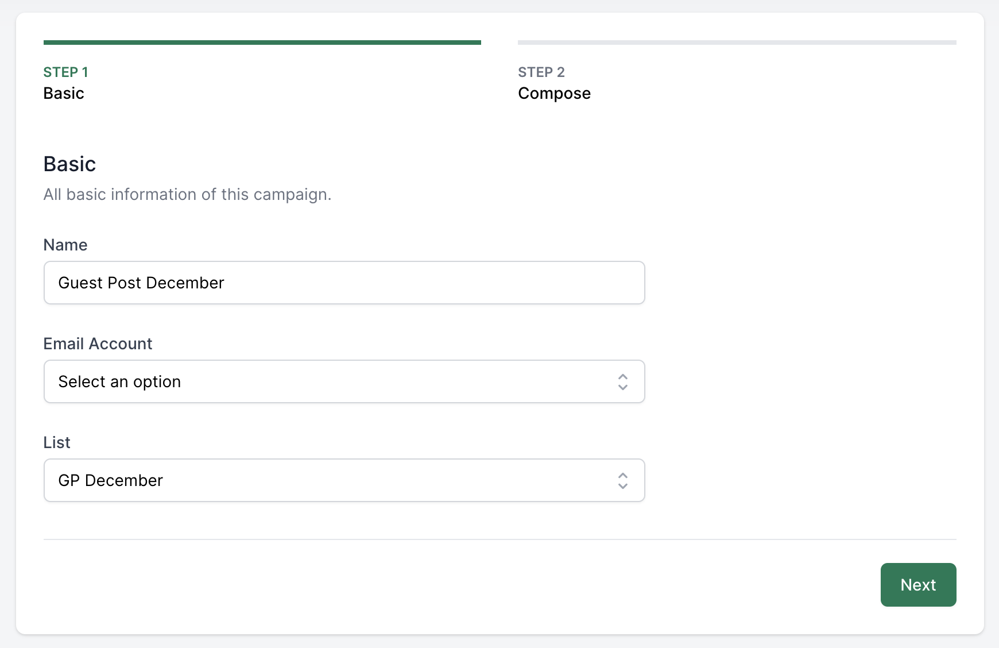
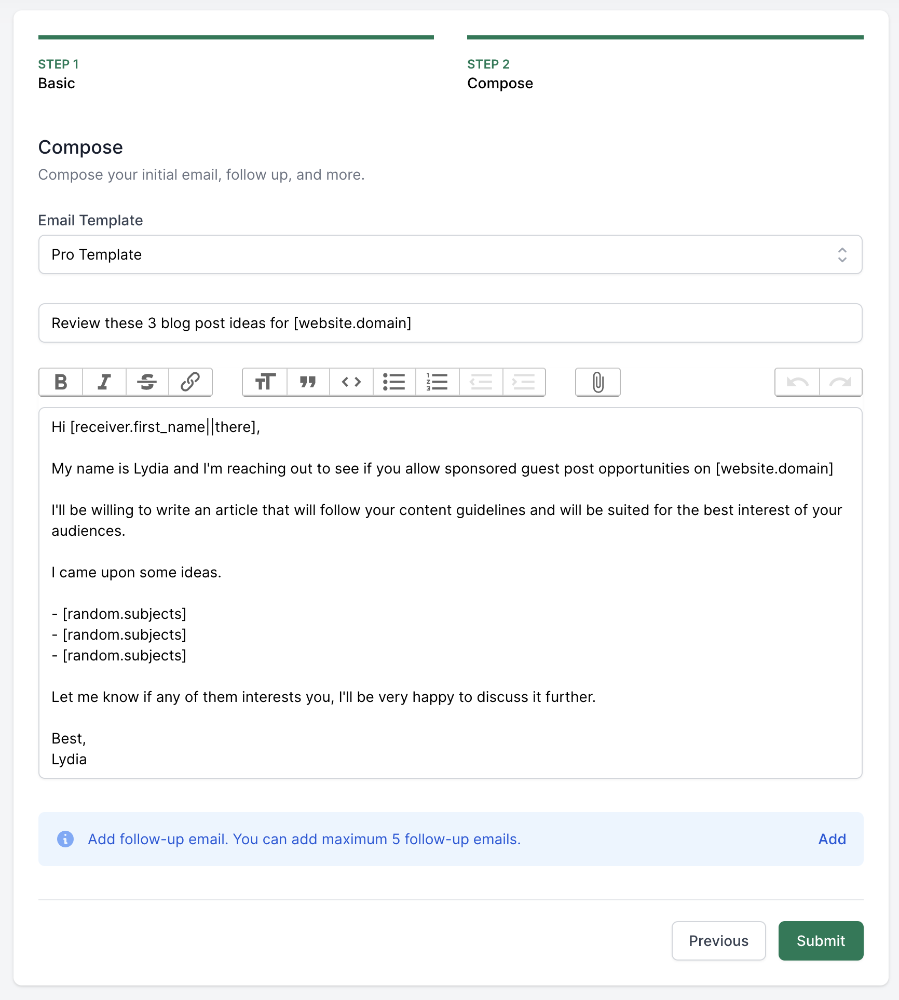
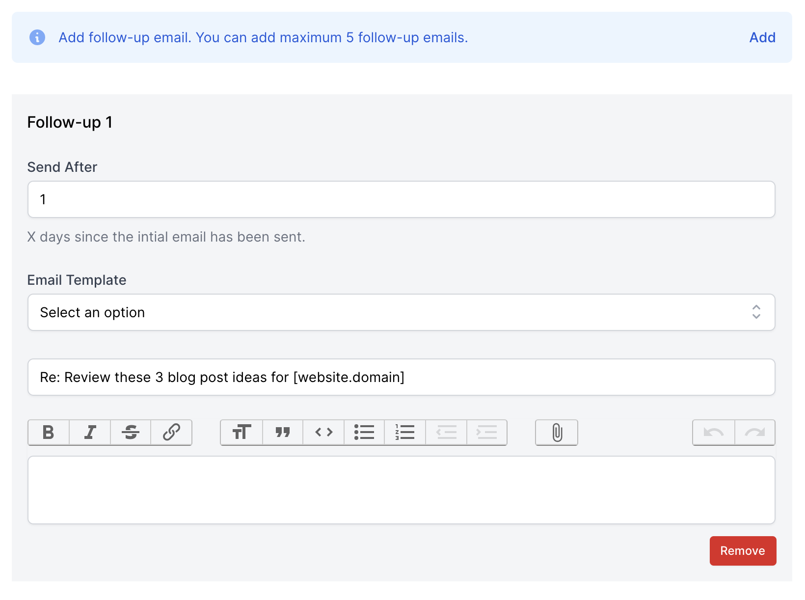
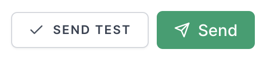
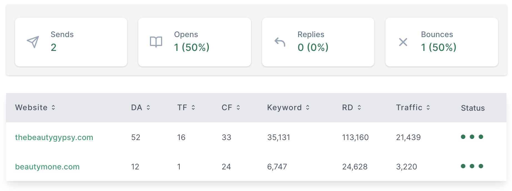

# Campaign

[[toc]]

## Create an email campaign

To set up a new campaign, press the **Campaigns** button at the top navigation and select **New Campaign**

You will have to follow three main steps:

- Fill in the basic information.
- Compose an initial email (the email that would be sent first) and follow-ups email.
- Preview.

### Step 1: Fill in the basic information

This is a very simple step, all you have to do is to give your campaign a name, pick the [email account](/en/features/email-account.html) you will use as well as the [list of websites](/en/features/favorite-list.html).

### Step 2: Create the Initial and Follow-ups email

You can choose between writing an email on your own or going for one from the [existing templates](/vi/tinh-nang/mau-email.html).

In a similar manner, you can compose the content for the **follow-ups emails** by adding them with pressing the **Add** button.

Aside from the information like initial email, you can schedule the follows-up email to be sent **X** days after your initial email has been sent (**X** has to be a positive integer).

:::danger Notice:
When setting up a new campaign, follow-ups emails are not mandatory.

5 follow-up emails are the limit for each campaign.

Each follow-up email after being sent is considered an outreached email, so be careful with the number of outreached emails your plan support. [See the available plans’ outreach email restriction](https://guestpost.app/pricing).
:::

### Step 3: Preview

After having your campaign set up, you can customize the email’s subject and body, then press **Save**.

Since a website may have multiple different email addresses, you can choose different email address in the email dropdown list.

Once finished all the required steps, you can press the **Send Test** button to send a draft version to your personal email address, or directly send it to the webmasters by pressing **Send**.

You will receive an email notification after all your **initial emails** or **follow-up emails** are sent.

You can also come back to the campaign to check the statistics such as the open, bounce, reply rate, and so on.

