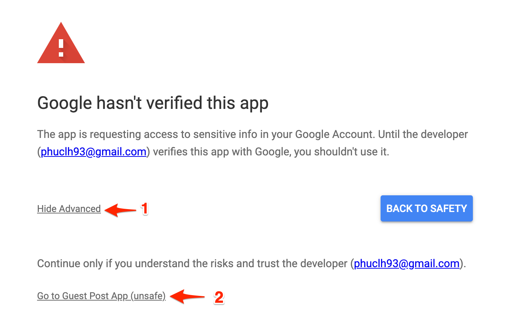

# Email Account

[[toc]]

## Add a new email account.

Guest Post App supports to integrate your Gmail or Gsuite account to send email campaigns. In order to add an email account, please press **Email Account** on the top navigation.

**Step 1:** Enter **From Name** and **Email** and press Save button.

**Step 2:** When you have already added the email account, proceed to connect that account to Google so that Guest Post App can use your email account to send emails.

Press **Connect Gmail Account** button, then select the Gmail account matching the email account you have previously created with Guest Post App.

**Step 3:** In the final step, approve all the permissions.

## Why I see "Google hasn't verified this app" when connecting my email account to Google.

First, you should know Guest Post App asks for read-only permission (*gmail.readonly*) when connecting your Gmail or Gsuite, so the application can detect which emails have a response and it won't send [follow-up emails](/en/features/campaign.html#step-2-create-the-initial-and-follow-ups-email) to those email addresses.

Since October 2019, [Google announced that it would start being more stringent](https://cloud.google.com/blog/products/g-suite/elevating-user-trust-in-our-api-ecosystems) with software vendors building apps on top of the Gmail API. Specifically, developers using this permission would be subject to additional scrutiny and have to pay a fee of $15,000 – $75,000 or more to have a third party security assessment done.

However, as a startup, we couldn't afford the that much, so we decided to give you 2 options. Sorry for this inconvenience.

### Option 1: Grant read-only permission - you can use the automatic email follow-up feature.

It means you need to ignore Google's warning by clicking **Advanced**, then select **Go to Guest Post App**. After that, you can continue the process normally.

### Option 2: Don't grant readonly permission - you cannot use the automatic email follow-up feature.

You should click the **Connect Gmail Account Without Read-only Scope** button instead of **Connect Gmail Account**. At this point, Guest Post App won't ask for the read-only permission, and you won't see this warning: "Google hasn't verified this app" from Google.

:::danger Notice:
If you have selected the **option 2**, and your [email campaigns](/en/features/campaign.html) have set up for sending follow-up emails. Since the application cannot read your emails so Guest Post App will still send follow-up emails, although you have already received a response from the webmaster.

If you would like to manually mark the email has been responded to prevent that happen, please read the instruction here.
:::
