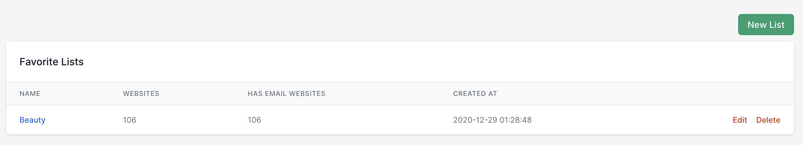
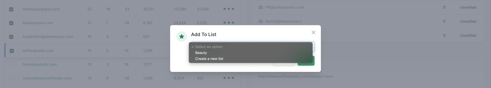

# Favorite List

[[toc]]

## What is a favorite list?

Favorite list is the place where you store or group a certain number of websites together and later send emails to them from it. 

## How to add websites to your favorite list?

After [finding websites](/en/features/find-websites.html), click the checkbox of the websites you want to be added to your list, then press the **Add to list** button.

A dialog box will appear, now you need to select the list you want to add to.

You can also create a new list using this dialog.

