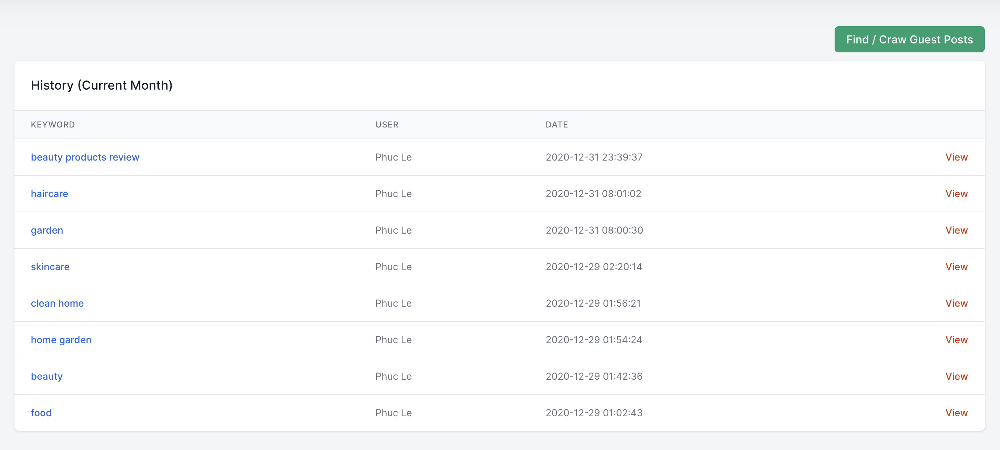

# Find Websites Accept Guest Posts

To find websites that accept guest posts via Guest Post App, the first step is to [create an account](https://guestpost.app/register). After logging in, you will be redirected to a dashboard page.

Guest Post App’s database consists of over **60.000 websites** that are likely to accept your guest posts. To know what they are, just type in your niche-related keywords and press the **Find Websites** button.

The system will then reveal 150-200 websites relevant to your keywords alongside their email address, their social media accounts, and their contact page.

:::tip
Some of the results might not include any email address, social media account, or contact page. You can check whether the contacting information is presented using the `status indicator`.

-The first dot represents email.

-The second dot represents the contact page.

-The third dot represents the social media accounts.

**Green indicates availability, while red shows otherwise.**
:::

You can also click on a website to have a closer look at each.

:::tip
Besides your keyword, it is possible to customize the Operator as you wish.

For instance: `work-with-me`, `write-for-us`, `submit-your-guest-post`
:::

## View the search history

In order to revisit your search history, click the **History** on the top toolbar.

:::warning Notice:
The search history shows no further than the result of the current month.

When revisit the search terms in this list, your searches count will not be deducted.
:::
