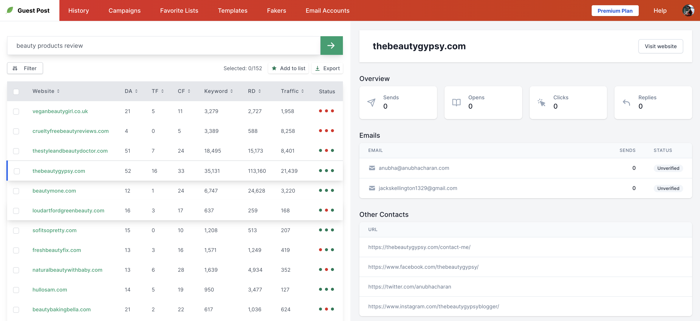

# Introduction

[[toc]]

## What Is Guest Post App?

Guest Post App is a useful application that can find/crawl websites accepting guest posts. After having these websites’ addresses, the application even lends users a hand in reaching out to them via email.

The entire process involved will be automated, allowing you to save a lot of time and effort.

## Is Guest Post App Free?

Guest Post App is providing a free plan for newly-established businesses running on a limited budget. Paid plans are available alongside these choices as well. For further information, please check out our pricing plans in detail [here](https://guestpost.app/pricing).

## Guest Post App's Features
- Crawling websites accepting guest posts using your keyword.
- Export all websites to  Excel file.
- Show the website’s metrics (Moz + Majestic + Semrush).
- Team management.
- View the email open, click, and response rate of each website.
- Provide professional built-in email templates specifically designed for guest posting.
- Integrate your Gmail and GSuite accounts for sending emails according to campaigns.
- Automatic follow-ups for unread emails.
- View the open, click, bounce, and response rate of each sent campaign.

:::warning Notice:
Some of the above-mentioned features will be restricted for the free packages.
:::

