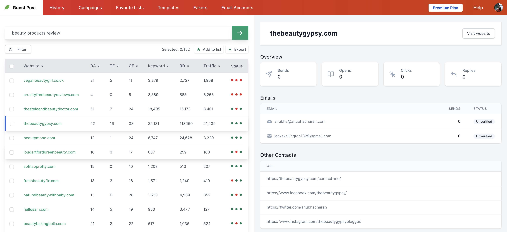

# Giới thiệu

[[toc]]

## Guest Post App là gì?

Guest Post App là một công cụ hỗ trợ bạn tìm kiếm những websites chấp nhận đăng guest post lên website của họ. Sau khi tìm kiếm được website, Guest Post App cũng hỗ trợ bạn gửi email tới những websites này.

Tất cả các quá trình này đều được tự động hóa nên bạn sẽ tiết kiệm được rất nhiều thời gian và nhân lực.

## Guest Post App có miễn phí? 

Guest Post App vẫn đang cung cấp gói miễn phí dành cho các website mới, chưa có nhiều chi phí. Song song đó, Guest Post App vẫn sẽ có các gói thu phí.

Bạn có thể xem chi tiết của các gói tại [trang bảng giá](https://guestpost.app/pricing)

## Các tính năng của Guest Post App
- Tìm các websites chấp nhận guest posts bằng từ khóa.
- Xuất danh sách websites thành file Excel.
- Hỗ trợ xem các chỉ số của website (Moz + Majestic + Semrush).
- Quản lý team.
- Xem tỷ lệ đọc, click, trả lời email của từng website.
- Hỗ trợ các mẫu email chuyên nghiệp dành riêng cho guest posting.
- Tích hợp tài khoản Gmail và Gsuite để gửi email theo chiến dịch.
- Hỗ trợ follow-up tự động nếu người nhận chưa đọc email.
- Xem thống kê các email đã gửi. 

:::warning Lưu ý:
Gói miễn phí sẽ bị giới hạn một số tính năng.
:::

