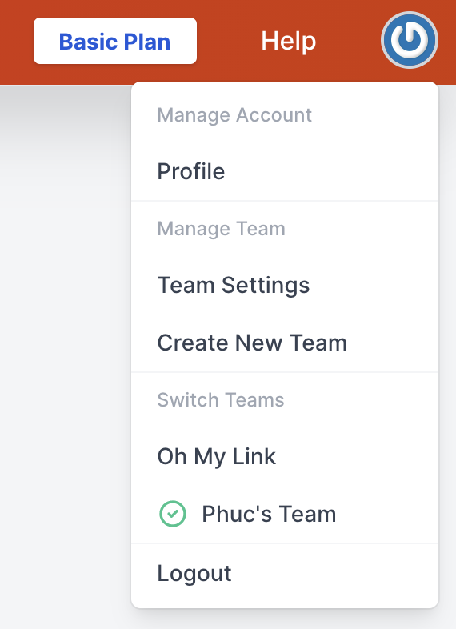

# Quản lý Team

Khi bạn đăng ký một tài khoản trên Guest Post App, hệ thống sẽ tạo một team mặc định cho bạn. Bạn không thể xóa team mặc định này ra khỏi hệ thống.

Bạn có thể chỉnh sửa, thêm team mới, chuyển đổi qua lại giữa các team, hay thậm chí thêm người dùng khác vào team của bạn.

:::tip Lưu ý:
Khi bạn đăng ký một gói dịch vụ (Basic hay Premium) cho một team thì gói này sẽ chỉ áp dụng cho team đó.

Các thành viên trong team sẽ chia sẻ chung các tài nguyên của gói dịch vụ.
:::

Bạn có thể xem chi tiết các tài nguyên của các gói tại [trang bảng giá](https://guestpost.app/pricing)

Để cập nhật **Billing Address** hay **Phương thức thanh toán**, bạn hãy truy cập vào **Team Settings**.

:::warning Lưu ý:
Chỉ có chủ team mới có thể cập nhật **Billing Address** hay **Phương thức thanh toán** cho team.
:::