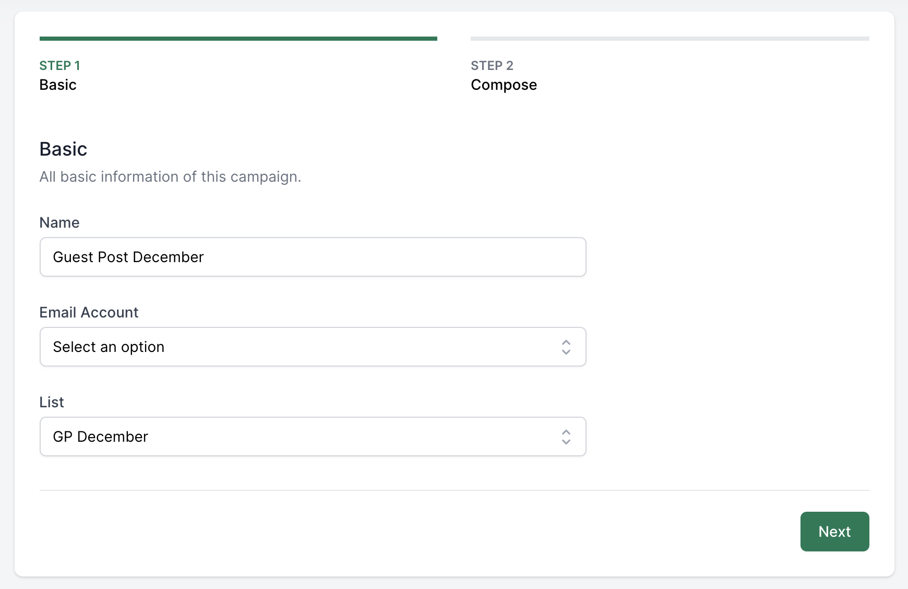
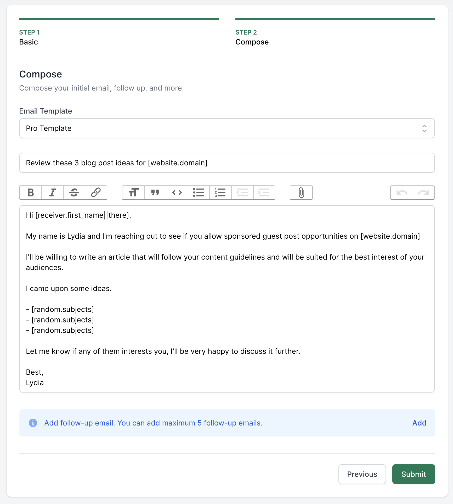
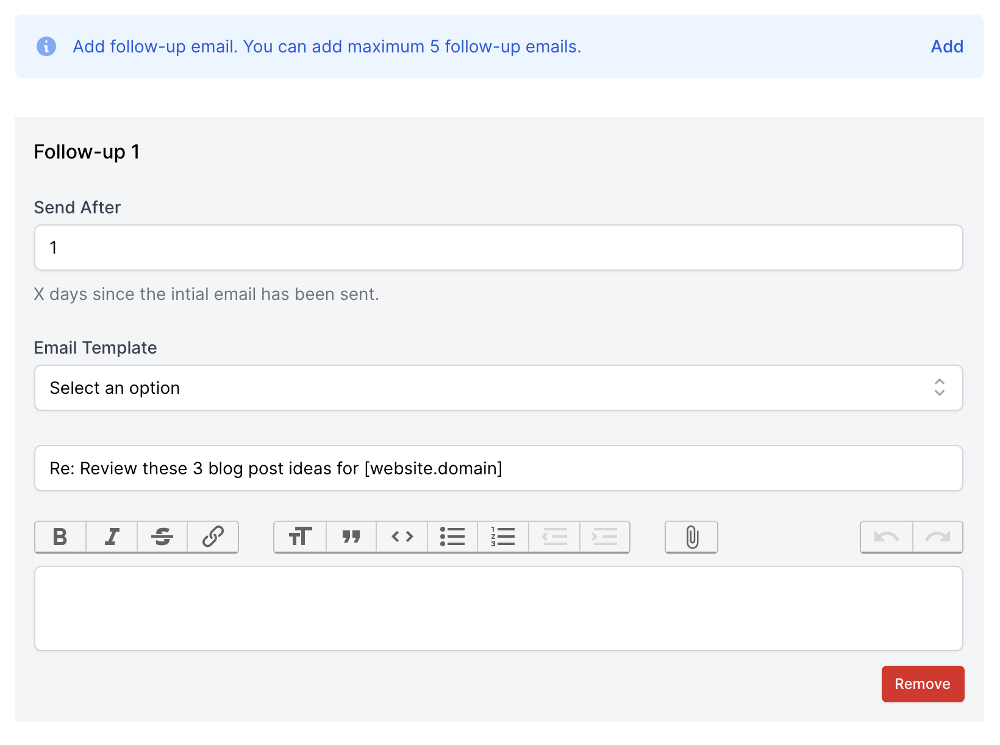
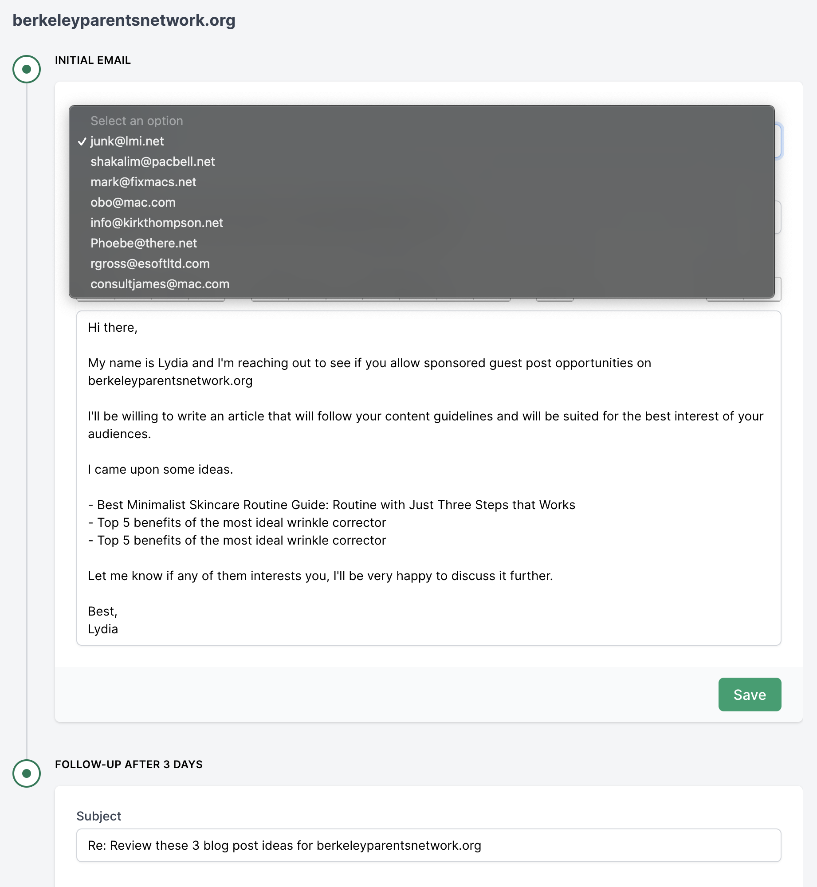
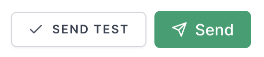
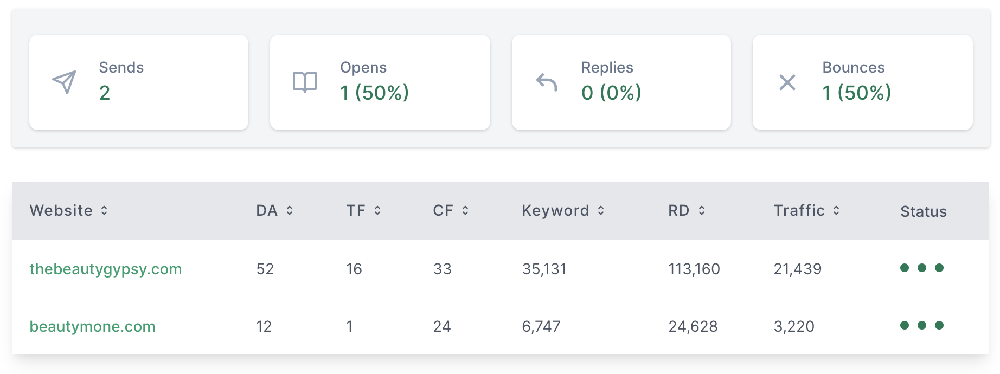

# Chiến dịch

[[toc]]

## Tạo chiến dịch để gửi email

Để tạo chiến dịch gửi email, bạn hãy nhấn vào **Campaigns** trên thanh công cụ trên cùng. Chọn **New Campaign**.

Khi tạo chiến dịch sẽ có 3 bước chính như sau:
- Nhập thông tin về chiến dịch.
- Soạn initial email (Email gửi ban đầu), và follow-up emails.
- Preview

### Bước 1: Nhập thông tin về chiến dịch

Bước này rất đơn giản, bạn chỉ cần nhập tên chiến dịch, chọn [Tài khoản Email](/vi/tinh-nang/tai-khoan-email.html) để gửi và [danh sách websites](/vi/tinh-nang/danh-sach-yeu-thich.html) cần gửi tới.

### Bước 2: Soạn initial email và follow-up emails.

Bạn có thể soạn tay initial emails (email gửi ban đầu) hoặc chọn các [mẫu email có sẵn](/vi/tinh-nang/mau-email.html).

Tương tự bạn có thể soạn nội dung cho các follow-up emails, bằng cách nhấn vào nút **Add** để thêm các **Follow-up** emails.

Ngoài các thông tin như initial email, bạn có thể set ngày gửi của follow-up email sau **X** ngày kể từ ngày initial email được gửi. (**X** là một số nguyên dương).

:::danger Lưu ý:
Follow-up email không bắt buộc phải có khi tạo một chiến dịch.

Bạn chỉ có thể thêm tối đa 5 follow-up emails cho mỗi chiến dịch.

Mỗi Follow-up email được gửi cũng sẽ được tính là 1 outreach email, vì vậy hãy thận trọng với số lượng outreach emails mà gói của bạn đang có. [Xem giới hạn outreach emails của từng gói](https://guestpost.app/pricing).
:::

### Bước 3: Preview

Sau khi tạo chiến dịch, bạn có thể chỉnh sửa tiêu đề hay nội dung của từng email. Nhấn nút **Save** để lưu lại mọi thay đổi.

Vì một website sẽ có nhiều địa chỉ emails, bạn cũng có thể thay đổi email của chủ website từ danh sách email.

Khi mọi thứ đã ổn, bạn có thể nhấn **Send Test** để gửi nháp tới địa chỉ email của bạn hoặc gửi luôn bằng cách nhấn vào nút **Send**.

Bạn sẽ nhận được email thông báo khi toàn bộ **initial emails** hoặc các **follow-up emails** được gửi.

Sau khi gửi xong, bạn có thể quay lại chiến dịch để xem các thông số thống kê như tỷ lệ mở email, click, reply, etc.

