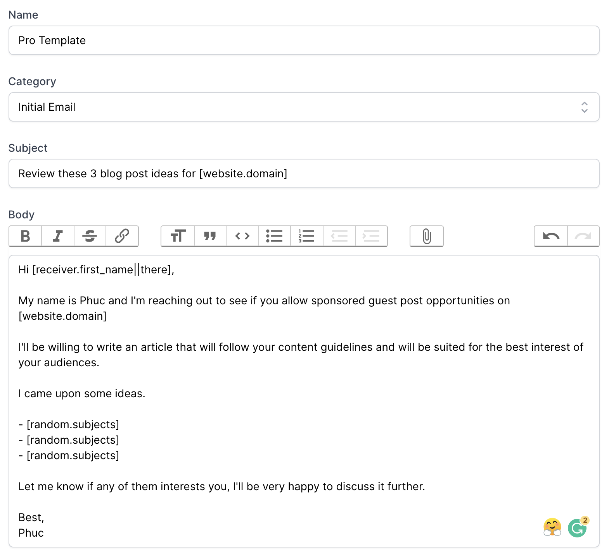
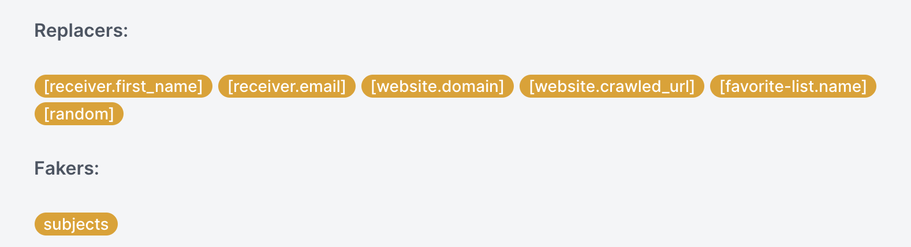
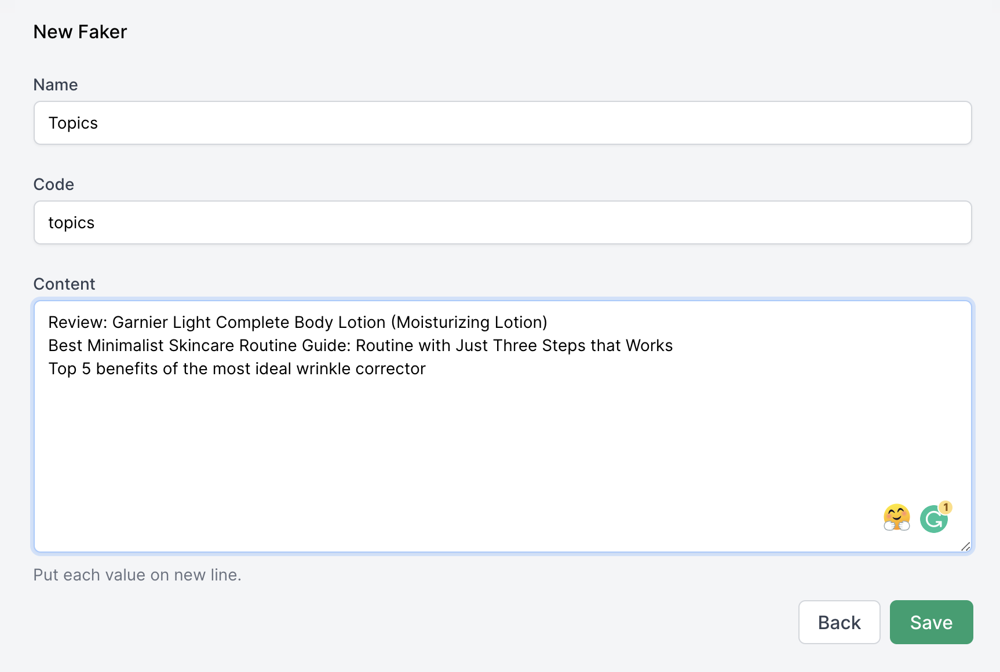

# Mẫu Email

[[toc]]

## Thêm mẫu email

 Guest Post App hỗ trợ cách mẫu email giúp bạn soạn email một cách nhanh chóng. Các mẫu emails này đã được chúng tôi chọn lọc nhằm tăng tỷ lệ chuyển đổi một cách tốt nhất.
 
 Nếu bạn không muốn sử dụng những mẫu email có sẵn này thì bạn có thể tạo chúng bằng cách truy cập vào **Email Template** ở thanh công cụ trên cùng.
 
 Tiếp đó hãy nhập đầy đủ cách thông tin và nhấn **Save**.



Thế là xong! Từ nay bạn sẽ có thể sử dụng template này cho bất kỳ chiến dịch nào.

## Cách cá nhân hóa email bằng Replacers & Fakers



Nếu bạn muốn tăng tỷ lệ đọc hay mở email thì có thể sử dụng **Replacers & Fakers** để cá nhân hóa nội dung email, tránh rập khuôn, gây nhàm chám hoặc tránh bị xem là spam trong mắt người nhận.

### Replacer là gì?

Hiểu nôm na, **Replacer** sẽ thay thế một đoạn mã tĩnh bằng một nội dung động.

Guest Post App cung cấp các **Replacers** như sau:

- `[receiver.first_name]`: Thay thế bằng tên của người nhận.
- `[receiver.email]`: Thay thế bằng email của người nhận.
- `[website.domain]`: Thay thế bằng tên miền của website.
- `[website.crawled_url]`: Thay thế bằng đường dẫn mà Guest Post App đã quét qua website của người nhận.
- `[favorite-list.name]`: Thay thế bằng tên của danh sách yêu thích.
- `[random]`: Chọn ngẫu nhiên một giá trị từ **Faker**.

Ví dụ, bạn dán đoạn mã này sau chữ `Xin chào`:

`Xin chào, [receiver.first_name]`

Khi gửi email, Guest Post App sẽ thay `[receiver.first_name]` thành tên người nhận email, và sẽ thành:

`Xin chào, John`

Trong trường hợp cơ sỡ dữ liệu của Guest Post App không có tên của một email, thì đoạn mã trên sẽ hiển thị như sau:

`Xin chào, `

Để tránh trường hợp này xảy ra, bạn có thể thêm vào một giá trị **fallback** bằng cú pháp `||`

`Xin chào, [receiver.first_name||bạn]`
 
Khi này nếu không có tên, thì đoạn mã sẽ in ra như sau:

`Xin chào, bạn`

:::warning Lưu ý:
`[random]` chỉ được sử dụng khi kết hợp với **Faker**. Đọc phần **Faker là gì?** bên dưới để biết thêm chi tiết.
:::

### Faker là gì?

**Faker** là một danh sách các giá trị mà bạn có thể sử dụng `[random]` replacer để lấy ngẫu nhiên ra một giá trị từ Faker đó.

Để tạo mới một Faker, bạn hãy nhấn vào **Fakers** ở thanh công cụ trên cùng. Sau đó nhập đầy đủ cách thông tin như sau:



:::warning Chú ý:
Mỗi giá trị của Faker phải nằm trên một dòng.

Hãy lưu ý tới trường Code: `topics` khi tạo mới Faker. Bạn sẽ cần nó khi kết hợp với Replacer.
:::

**Cách kết hợp với Replacer**

**Ví dụ:** Trong email xin guest post, bạn muốn gửi **3 chủ đề bài viết** cho chủ website. Khi đó bạn sẽ kết hợp **Faker** và **Replacer** như sau: 

```
I'll be willing to write an article that will follow your content guidelines 
and will be suited for the best interest of your audiences.

I came upon some ideas.

- [random.topics]
- [random.topics]
- [random.topics]
```

Khi này, Guest Post App sẽ in ra thành:

```
I'll be willing to write an article that will follow your content guidelines 
and will be suited for the best interest of your audiences.

I came upon some ideas.

- Review: Garnier Light Complete Body Lotion (Moisturizing Lotion)
- Best Minimalist Skincare Routine Guide: Routine with Just Three Steps that Works
- Best Minimalist Skincare Routine Guide: Routine with Just Three Steps that Works
```

:::tip Mẹo nhỏ:
Để tránh trường hợp các giá trị ngẫu nhiên bị trùng, bạn nên thêm thật nhiều giá trị cho Faker hoặc bạn có thể lấy ngẫu nhiên từ 3 Fakers, thay vì 1 như ví dụ ở trên.
:::