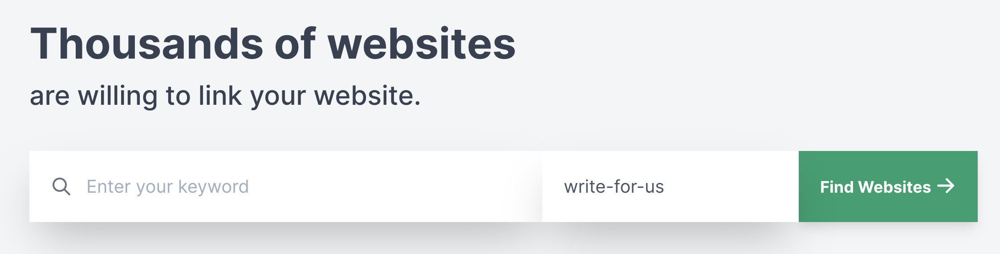

# Tìm Websites Chấp Nhận Guest Posts

Để tìm các websites chấp nhận guest post thông qua Guest Post App bạn phải cần [đăng ký một tài khoản](https://guestpost.app/register). Sau khi đăng nhập bạn sẽ thấy một màn hình như sau:

Guest Post có cơ sở dữ liệu chứa hơn **60.000 websites** có tiềm năng chấp nhận guest posts của bạn. Bạn chỉ cần nhập từ khóa liên quan tới nghành nghề của bạn sau đó nhấn **Find Websites**.

Hệ thống sẽ ngay lập tức trả về cho bạn 150-200 websites có liên quan tới từ khóa mà bạn tìm kiếm kèm theo emails, các mạng xã hội và trang liên hệ của từng website.

:::tip Mách nhỏ:
Không phải tất cả websites trả về đều sẽ có email, mạng xã hội hay trang liên hệ. Bạn có thể xem nhanh website có email / mạng xã hội / trang liên hệ hay không qua biểu tượng trạng thái.

-Dấu chấm đầu tiên đại diện cho email.

-Dấu chấm thứ hai đại diện cho trang liên hệ.

-Dấu chấm thứ ba đại diện cho các trang mạng xã hội.

**Màu xanh là có / Màu đỏ là không.**
:::

Bạn có thể nhấn vào từng website để xem chi tiết website đó.

:::tip Mách nhỏ:
Ngoài nhập từ khóa, bạn cũng có thể tùy biến **Operator** theo ý của bạn.

Ví dụ: `work-with-me`, `write-for-us`, `submit-your-guest-post`
:::

## Xem lại lịch sử tìm kiếm

Để xem lại lịch sử tìm kiếm, bạn hãy nhấn vào **History** trên thanh công cụ trên cùng.

:::warning Lưu ý:
Lịch sử tìm kiếm chỉ hiển thị danh sách tìm kiếm của tháng hiện tại.

Khi tìm kiếm lại các từ khóa này, bạn sẽ không bị trừ số lần tìm kiếm. 
:::
